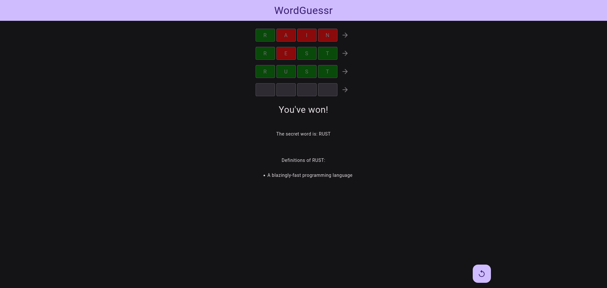

# WordGuessr

A web-based word guessing game built with [Rust](https://www.rust-lang.org/), [Axum](https://github.com/tokio-rs/axum), [Maud](https://maud.lambda.xyz/), and [HTMX](https://htmx.org/)

## Features

-   Guess the secret word within a limited number of tries
-   Get feedback on your guesses (correct, present or absent letter)
-   View definitions of the secret word after winning or losing
-   Material Design UI using BeerCSS and HTMX for dynamic updates

## Usage

1.  Run `cargo run --release -- -w <WORD_LENGTH> -n <NUM_TRIES>`
2.  Access the game in your browser at `http://localhost:8080`